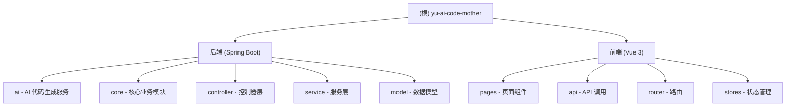

# yu-ai-code-mother 项目文档

## 变更记录 (Changelog)

| 时间 | 操作 | 说明 |
|------|------|------|
| 2026-03-12 21:20:45 | 初始化 | 创建项目 AI 上下文文档 |

---

## 项目愿景与定位

**yu-ai-code-mother** 是一个基于 LangChain4j 的 AI 代码生成平台，旨在通过自然语言描述自动生成前端代码。项目支持多种代码生成模式，包括单文件 HTML 和多文件（HTML + CSS + JS）模式，并支持流式响应以提升用户体验。

**核心能力**：
- 通过自然语言描述生成前端代码
- 支持 DeepSeek 等 AI 模型
- 支持同步和流式两种代码生成方式
- 完整的用户管理功能（注册、登录、权限控制）

---

## 架构总览

```
yu-ai-code-mother-myself/
├── src/main/java/                    # 后端 Java 源码
│   └── com/yupi/yuaicodemother/
│       ├── YuAiCodeMotherApplication.java  # 应用入口
│       ├── ai/                        # AI 服务层
│       ├── aop/                       # AOP 切面
│       ├── annotation/                # 自定义注解
│       ├── common/                    # 公共响应类
│       ├── config/                    # 配置类
│       ├── constant/                  # 常量
│       ├── controller/                # 控制器层
│       ├── core/                      # 核心业务模块
│       ├── exception/                 # 异常处理
│       ├── generator/                 # 代码生成器
│       ├── mapper/                    # MyBatis Mapper
│       ├── model/                     # 实体、DTO、VO、枚举
│       └── service/                   # 服务层
├── src/main/resources/                # 资源文件
│   ├── application.yml                # 主配置文件
│   ├── mapper/                        # MyBatis XML
│   └── prompt/                        # AI Prompt 模板
└── yu-ai-code-mother-frontend/        # 前端项目
    └── src/
        ├── api/                       # API 接口
        ├── components/                # Vue 组件
        ├── layouts/                   # 布局组件
        ├── pages/                     # 页面
        ├── router/                    # 路由配置
        └── stores/                    # Pinia 状态管理
```

---

## 模块结构图



---

## 模块索引

| 模块路径 | 语言/框架 | 职责描述 | 入口文件 | 文档链接 |
|---------|----------|---------|---------|---------|
| `.` (根目录) | Java 21 + Spring Boot 3.5.4 | 后端服务，AI 代码生成核心逻辑 | `YuAiCodeMotherApplication.java` | 本文档 |
| `yu-ai-code-mother-frontend` | Vue 3.5 + TypeScript | 前端界面，用户交互 | `main.ts` | [查看文档](./yu-ai-code-mother-frontend/CLAUDE.md) |

---

## 技术栈

### 后端技术栈

| 技术 | 版本 | 用途 |
|------|------|------|
| Java | 21 | 编程语言 |
| Spring Boot | 3.5.4 | 应用框架 |
| LangChain4j | 1.1.0 | AI 应用开发框架 |
| MyBatis-Flex | 1.11.1 | ORM 框架 |
| MySQL | - | 关系型数据库 |
| HikariCP | 4.0.3 | 数据库连接池 |
| Knife4j | 4.4.0 | API 文档 (OpenAPI 3) |
| Lombok | 1.18.36 | 代码简化 |
| Hutool | 5.8.38 | Java 工具库 |

### AI 模型配置

项目默认配置 DeepSeek 作为 AI 模型提供者：
- 模型：`deepseek-chat`
- 最大 Token：8192
- 支持同步和流式两种调用方式

### 前端技术栈

| 技术 | 版本 | 用途 |
|------|------|------|
| Vue | 3.5.17 | 前端框架 |
| TypeScript | 5.8.0 | 类型安全 |
| Vite | 7.0.0 | 构建工具 |
| Ant Design Vue | 4.2.6 | UI 组件库 |
| Pinia | 3.0.3 | 状态管理 |
| Vue Router | 4.5.1 | 路由管理 |
| Axios | 1.11.0 | HTTP 客户端 |

---

## 运行与开发

### 环境要求

- JDK 21+
- Node.js 22+
- MySQL 8.0+
- Maven 3.8+

### 后端启动

```bash
# 1. 配置数据库
# 创建数据库：yu_ai_code_mother
# 修改 application-local.yml 中的数据库连接信息

# 2. 配置 AI 模型
# 在 application-local.yml 中设置 langchain4j.open-ai.chat-model.api-key

# 3. 启动应用
mvn spring-boot:run

# 后端服务将在 http://localhost:8123/api 启动
# API 文档地址：http://localhost:8123/api/doc.html
```

### 前端启动

```bash
cd yu-ai-code-mother-frontend

# 安装依赖
npm install

# 生成 API 接口代码（需要后端运行）
npm run openapi2ts

# 启动开发服务器
npm run dev

# 前端服务将在 http://localhost:5173 启动
```

### 常用命令

```bash
# 后端
mvn clean install    # 构建项目
mvn test             # 运行测试

# 前端
npm run build        # 构建生产版本
npm run lint         # 代码检查
npm run format       # 代码格式化
```

---

## 测试策略

### 后端测试

- 单元测试位于 `src/test/java` 目录
- 使用 JUnit 5 + Spring Boot Test
- 已有测试用例：
  - `AiCodeGeneratorServiceTest`：AI 服务测试
  - `CodeParserTest`：代码解析器测试
  - `AiCodeGeneratorFacadeTest`：门面类测试

### 前端测试

- 暂无自动化测试
- 建议添加：Vitest + Vue Test Utils

---

## 编码规范

### 后端规范

1. **包结构**：按功能分层（controller、service、mapper、model）
2. **命名规范**：类名大驼峰，方法名小驼峰
3. **注释**：类和方法必须有 JavaDoc 注释
4. **异常处理**：使用 `BusinessException` 和 `GlobalExceptionHandler`
5. **响应格式**：统一使用 `BaseResponse` 包装

### 前端规范

1. **组件命名**：大驼峰（如 `HomePage.vue`）
2. **API 调用**：统一通过 `src/api/` 目录管理
3. **状态管理**：使用 Pinia，状态文件放 `stores/` 目录
4. **代码格式化**：使用 Prettier
5. **类型安全**：严格使用 TypeScript

---

## AI 使用指引

### 代码生成相关

1. **Prompt 模板位置**：`src/main/resources/prompt/`
   - `codegen-html-system-prompt.txt`：单文件 HTML 生成
   - `codegen-multi-file-system-prompt.txt`：多文件生成

2. **代码生成流程**：
   ```
   用户输入 -> AiCodeGeneratorFacade -> AiCodeGeneratorService -> DeepSeek AI
           -> CodeParserExecutor -> CodeFileSaverExecutor -> 保存文件
   ```

3. **支持的生成类型**：
   - `HTML`：单文件 HTML 模式
   - `MULTI_FILE`：多文件模式（HTML + CSS + JS）

### AI 辅助开发建议

1. 修改 AI Prompt 时，注意保持输出格式的约束
2. 新增代码生成类型时，需要：
   - 在 `CodeGenTypeEnum` 添加枚举值
   - 创建对应的 `CodeParser` 实现
   - 创建对应的 `CodeFileSaverTemplate` 实现
   - 添加对应的 Prompt 模板

---

## 关键配置说明

### application.yml 核心配置

```yaml
server:
  port: 8123
  servlet:
    context-path: /api

spring:
  datasource:
    url: jdbc:mysql://localhost:3306/yu_ai_code_mother
    username: root
    password: 123456

langchain4j:
  open-ai:
    chat-model:
      base-url: https://api.deepseek.com
      model-name: deepseek-chat
      max-tokens: 8192
```

---

## 相关文件清单

### 后端核心文件

| 文件路径 | 说明 |
|---------|------|
| `pom.xml` | Maven 依赖配置 |
| `src/main/resources/application.yml` | 主配置文件 |
| `src/main/java/.../YuAiCodeMotherApplication.java` | 应用入口 |
| `src/main/java/.../core/AiCodeGeneratorFacade.java` | AI 代码生成门面 |
| `src/main/java/.../ai/AiCodeGeneratorService.java` | AI 服务接口 |
| `src/main/java/.../controller/UserController.java` | 用户控制器 |
| `src/main/resources/prompt/*.txt` | AI Prompt 模板 |

### 前端核心文件

| 文件路径 | 说明 |
|---------|------|
| `yu-ai-code-mother-frontend/package.json` | 前端依赖配置 |
| `yu-ai-code-mother-frontend/vite.config.ts` | Vite 构建配置 |
| `yu-ai-code-mother-frontend/src/main.ts` | 前端入口 |
| `yu-ai-code-mother-frontend/src/router/index.ts` | 路由配置 |
| `yu-ai-code-mother-frontend/openapi2ts.config.ts` | API 生成配置 |

---

## 常见问题 (FAQ)

### Q: 如何更换 AI 模型？

A: 修改 `application.yml` 中的 `langchain4j.open-ai` 配置，将 `base-url` 和 `model-name` 改为对应的模型配置。

### Q: 如何添加新的代码生成类型？

A:
1. 在 `CodeGenTypeEnum` 添加新枚举值
2. 创建对应的 `CodeParser` 实现类
3. 创建对应的 `CodeFileSaverTemplate` 实现类
4. 在 `AiCodeGeneratorFacade` 中添加对应的处理逻辑
5. 添加对应的 Prompt 模板文件

### Q: 前端如何调用后端 API？

A: 运行 `npm run openapi2ts` 会自动根据后端 OpenAPI 文档生成类型安全的 API 调用代码。

---

## 下一步建议

1. 完善前端模块的 CLAUDE.md 文档
2. 补充数据库表结构文档
3. 添加 API 接口详细说明
4. 完善测试用例覆盖率