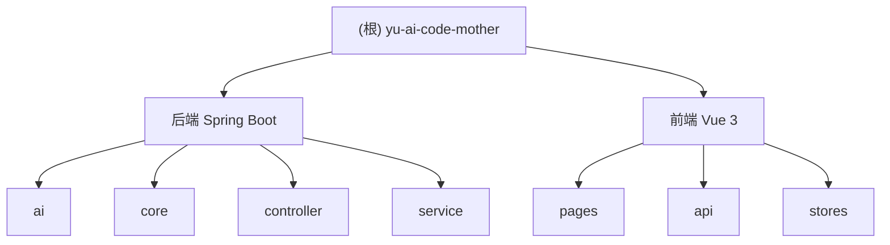

# yu-ai-code-mother 项目文档

## 变更记录 (Changelog)

| 时间 | 操作 | 说明 |
|------|------|------|
| 2026-03-26 | 更新 | 全仓扫描，补充 App/Deploy 模块、数据模型、完整 API 列表、业务流程 |
| 2026-03-12 21:20:45 | 初始化 | 创建项目 AI 上下文文档 |

---

## 项目愿景与定位

**yu-ai-code-mother** 是一个基于 LangChain4j 的 AI 代码生成平台，通过自然语言描述自动生成前端代码。支持单文件 HTML 和多文件（HTML + CSS + JS）两种模式，支持流式 SSE 响应。用户可创建「应用」绑定初始提示词，一键生成并部署前端页面。

**核心能力**：
- 自然语言描述生成前端代码（HTML / 多文件）
- 支持 DeepSeek 等兼容 OpenAI 协议的模型
- 同步和流式（SSE）两种代码生成方式
- 应用管理（创建/更新/删除/分页/精选）
- 应用部署（deployKey 唯一标识，静态文件托管）
- 用户管理（注册/登录/权限控制）

---

## 架构总览

```
yu-ai-code-mother-myself/
├── sql/create_table.sql
├── src/main/java/com/yupi/yuaicodemother/
│   ├── ai/          # LangChain4j 服务接口 + 工厂
│   ├── aop/         # @AuthCheck 权限切面
│   ├── common/      # BaseResponse / ResultUtils
│   ├── config/      # CorsConfig / JsonConfig
│   ├── controller/  # UserController / AppController / HealthController
│   ├── core/        # AiCodeGeneratorFacade + parser/ + saver/
│   ├── exception/   # ErrorCode / BusinessException / GlobalExceptionHandler
│   ├── mapper/      # UserMapper / AppMapper
│   ├── model/       # entity / dto / vo / enums
│   └── service/     # UserService / AppService / DeployService + impl/
├── src/main/resources/
│   ├── application.yml
│   ├── application-local.yml  # 已 gitignore
│   ├── mapper/
│   └── prompt/
├── src/test/java/
└── yu-ai-code-mother-frontend/
    └── src/ (api/ components/ layouts/ pages/ router/ stores/)
```

---

## 模块结构图



---

## 模块索引

| 模块路径 | 语言/框架 | 职责 | 入口文件 | 文档 |
|---------|----------|------|---------|------|
| `.`（后端） | Java 21 + Spring Boot 3.5.4 | AI 代码生成、用户/应用管理、部署 | `YuAiCodeMotherApplication.java` | 本文档 |
| `yu-ai-code-mother-frontend` | Vue 3.5 + TypeScript | 前端交互界面 | `src/main.ts` | [查看](./yu-ai-code-mother-frontend/CLAUDE.md) |

---

## 技术栈

### 后端

| 技术 | 版本 | 用途 |
|------|------|------|
| Java | 21 | 语言 |
| Spring Boot | 3.5.4 | 框架 |
| LangChain4j | 1.1.0 | AI 框架 |
| LangChain4j OpenAI Starter | 1.1.0-beta7 | OpenAI 协议集成 |
| LangChain4j Reactor | 1.1.0-beta7 | Flux 流式支持 |
| MyBatis-Flex | 1.11.1 | ORM |
| MySQL | 8.0+ | 数据库 |
| Knife4j | 4.4.0 | OpenAPI 文档 |
| Lombok | 1.18.36 | 代码简化 |
| Hutool | 5.8.38 | 工具库 |

### 前端

| 技术 | 版本 | 用途 |
|------|------|------|
| Vue | 3.5.17 | 框架 |
| TypeScript | 5.8.0 | 类型安全 |
| Vite | 7.0.0 | 构建 |
| Ant Design Vue | 4.2.6 | UI |
| Pinia | 3.0.3 | 状态管理 |
| Vue Router | 4.5.1 | 路由 |
| Axios | 1.11.0 | HTTP |
| @umijs/openapi | 1.13.15 | API 代码生成 |

---

## 运行与开发

```bash
# 数据库
source sql/create_table.sql

# 后端：创建 application-local.yml 填入 DB 密码和 AI API Key
mvn spring-boot:run
# http://localhost:8123/api  文档: /api/doc.html

# 前端
cd yu-ai-code-mother-frontend && npm install
npm run openapi2ts && npm run dev
# http://localhost:5173
```

---

## 核心业务流程

```
同步生成: POST /app/gen-code
  -> AiCodeGeneratorFacade.generateAndSaveCode(initPrompt, codeGenType, appId)
  -> AiCodeGeneratorService [DeepSeek JSON] -> CodeParserExecutor -> CodeFileSaverExecutor

流式生成: GET /app/chat-to-gen-code (SSE)
  -> AiCodeGeneratorFacade.generateAndSaveCodeStream() -> Flux<String>
  -> doOnComplete() 后解析并保存

部署: POST /app/deploy
  -> DeployService: 生成 6 位 deployKey -> 复制文件 -> 返回 URL
```

---

## 数据模型

### user 表

| 字段 | 类型 | 说明 |
|------|------|------|
| id | bigint PK | 雪花 ID |
| userAccount | varchar(256) UNIQUE | 账号 |
| userPassword | varchar(512) | 密码 |
| userName / userAvatar / userProfile | varchar | 昵称/头像/简介 |
| userRole | varchar(256) | user / admin |
| isDelete | tinyint | 逻辑删除 |

### app 表

| 字段 | 类型 | 说明 |
|------|------|------|
| id | bigint PK | 雪花 ID |
| appName / cover | varchar | 名称/封面 |
| initPrompt | text | 初始化提示词 |
| codeGenType | varchar(64) | html / multi_file |
| deployKey | varchar(64) UNIQUE | 部署标识 |
| deployedTime | datetime | 最近部署时间 |
| priority | int | 精选优先级 |
| userId | bigint | 创建用户 ID |
| isDelete | tinyint | 逻辑删除 |

---

## 后端 API 接口一览

### 用户 `/api/user`

| 方法 | 路径 | 权限 | 说明 |
|------|------|------|------|
| POST | `/user/register` | 公开 | 注册 |
| POST | `/user/login` | 公开 | 登录 |
| POST | `/user/logout` | 登录 | 退出 |
| GET | `/user/get/login` | 登录 | 获取当前用户 |
| POST | `/user/update` | 登录 | 更新个人信息 |
| POST | `/user/list/page/vo` | 管理员 | 分页查询用户 |
| POST | `/user/admin/update` | 管理员 | 管理员更新用户 |

### 应用 `/api/app`

| 方法 | 路径 | 权限 | 说明 |
|------|------|------|------|
| POST | `/app/add` | 登录 | 创建应用 |
| POST | `/app/delete` | 登录 | 删除自己的应用 |
| POST | `/app/update` | 登录 | 更新自己的应用 |
| GET | `/app/get/vo` | 登录 | 获取应用详情 |
| GET | `/app/my/list/page` | 登录 | 我的应用分页 |
| GET | `/app/featured/list/page` | 登录 | 精选应用分页 |
| POST | `/app/deploy` | 登录 | 部署应用 |
| GET | `/app/chat-to-gen-code` | 登录 | 流式生成代码（SSE） |
| POST | `/app/admin/delete` | 管理员 | 删除应用 |
| POST | `/app/admin/update` | 管理员 | 更新应用 |
| POST | `/app/list/page/vo` | 管理员 | 分页查询应用 |

---

## 测试策略

| 测试类 | 说明 |
|--------|------|
| `AiCodeGeneratorServiceTest` | AI 服务接口测试 |
| `CodeParserTest` | 代码解析器测试 |
| `AiCodeGeneratorFacadeTest` | 门面同步/流式测试 |
| `YuAiCodeMotherApplicationTests` | Spring 上下文加载 |

测试依赖真实 API Key，需在 `application-local.yml` 中配置。

---

## 编码规范

### 后端
1. 包按功能分层：controller / service / mapper / model
2. 统一用 `BaseResponse<T>` + `ResultUtils` 包装响应
3. 业务异常用 `BusinessException(ErrorCode, message)`
4. 权限用 `@AuthCheck(mustRole)` 注解 + AOP
5. 实体 ID 用雪花算法，逻辑删除用 `isDelete`

### 前端
1. 组件文件名大驼峰
2. API 调用统一通过 `src/api/`
3. 路由守卫在 `src/access.ts`
4. 严格使用 TypeScript 类型

---

## AI 使用指引

| 文件 | 用途 |
|------|------|
| `prompt/codegen-html-system-prompt.txt` | HTML 单文件生成 Prompt |
| `prompt/codegen-multi-file-system-prompt.txt` | 多文件生成 Prompt |

新增代码生成类型：在 `CodeGenTypeEnum`、`AiCodeGeneratorService`、`CodeParserExecutor`、`CodeFileSaverExecutor`、`AiCodeGeneratorFacade` 各处添加对应分支，并添加 Prompt 模板文件。

---

## 相关文件清单

| 文件路径 | 说明 |
|---------|------|
| `pom.xml` | Maven 依赖 |
| `sql/create_table.sql` | 数据库建表脚本 |
| `src/main/resources/application.yml` | 主配置 |
| `src/main/java/.../YuAiCodeMotherApplication.java` | 启动入口 |
| `src/main/java/.../core/AiCodeGeneratorFacade.java` | 代码生成门面 |
| `src/main/java/.../ai/AiCodeGeneratorService.java` | AI 服务接口 |
| `src/main/java/.../controller/AppController.java` | 应用控制器 |
| `src/main/java/.../controller/UserController.java` | 用户控制器 |
| `src/main/java/.../service/DeployService.java` | 部署服务接口 |
| `src/main/java/.../model/entity/App.java` | 应用实体 |
| `src/main/java/.../model/entity/User.java` | 用户实体 |
| `src/main/java/.../model/enums/CodeGenTypeEnum.java` | 代码生成类型枚举 |
| `src/main/resources/prompt/*.txt` | AI Prompt 模板 |
| `yu-ai-code-mother-frontend/package.json` | 前端依赖 |
| `yu-ai-code-mother-frontend/src/main.ts` | 前端入口 |
| `yu-ai-code-mother-frontend/src/router/index.ts` | 路由配置 |
| `yu-ai-code-mother-frontend/src/access.ts` | 权限控制 |

---

## 常见问题 (FAQ)

**Q: 如何更换 AI 模型？**
A: 修改 `application-local.yml` 中 `langchain4j.open-ai.*.base-url` 和 `model-name`，兼容任意 OpenAI 协议接口。

**Q: 如何添加新的代码生成类型？**
A: 参见「AI 使用指引 - 新增代码生成类型步骤」。

**Q: 前端 API 如何保持同步？**
A: 后端运行后执行 `npm run openapi2ts`，自动从 `/api/doc.html` 拉取 OpenAPI 规范并生成 `src/api/` 下的类型化代码。

**Q: application-local.yml 在哪里创建？**
A: 放在 `src/main/resources/application-local.yml`，该文件已在 `.gitignore` 中，不会提交到版本库。
